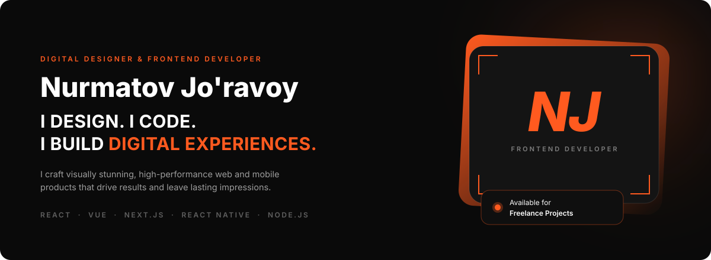
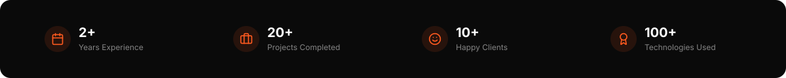
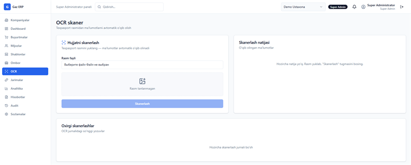
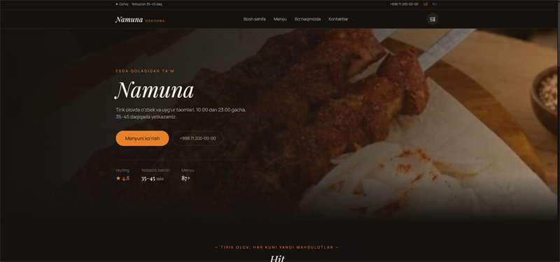
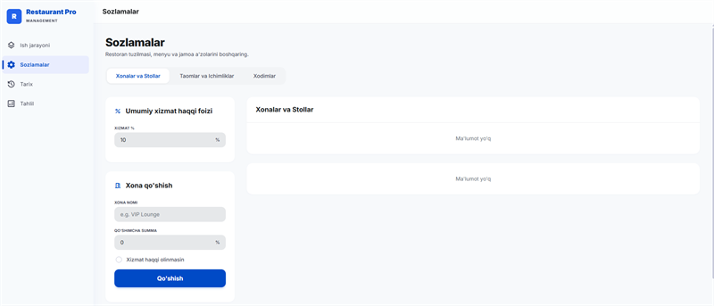
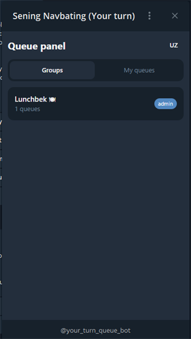

  
  

  
  
  
  

🇺🇿 &nbsp;<b>O'zbekcha o'qish</b>

 

Men **Nurmatov Jo'ravoy**man — g'oyalarni toza, zamonaviy va ishlaydigan veb-tajribaga aylantirishni yaxshi ko'radigan frontend dasturchiman. Diqqatim foydalanuvchiga yo'naltirilgan dizayn va piksel darajasidagi aniqlikda.

Veb tomonda **React, Vue.js va Next.js**, mobil tomonda **React Native va Expo** bilan ishlayman — mahsulot o'sgani sayin ham tez, qulay va qo'llab-quvvatlash oson bo'lib qolishi men uchun muhim.

| Xizmat | Nima qilaman |
| :-- | :-- |
| **Veb dasturlash** | React, Vue va Next.js yordamida tez, moslashuvchan va qulay saytlar quraman. |
| **Mobil dasturlash** | React Native va Expo bilan Android va iOS uchun bir vaqtda ishlaydigan ilovalar. |
| **UI ni kodga ko'chirish** | Figma dizaynlarini har qanday ekranda to'g'ri ishlaydigan piksel-aniq interfeysga aylantiraman. |
| **Panel va dashboardlar** | Filtrlar, jadvallar va grafiklari bilan katta hajmda ham qulay qoladigan admin panellar. |

| Loyiha | Yil | Texnologiyalar | Havola |
| :-- | :-- | :-- | :-- |
| **Gaz Ballon ERP** — ko'p kompaniyali ERP / SaaS | 2026 | React · NestJS · Prisma · PostgreSQL | [Jonli demo](https://usta-hona.vercel.app) |
| **Namuna Oshxona** — restoran sayti va buyurtma tizimi | 2026 | Vue 3 · NestJS · Prisma · Socket.IO | [Portfolioda](https://portfolio-ttzn.vercel.app/#projects) |
| **Restaurant Pro** — zal boshqaruvi va POS | 2026 | Vue 3 · Pinia · Chart.js · i18n | [Jonli demo](https://portfolio-cd1l.vercel.app) · [Kod](https://github.com/Muslim-Boy/restaurant-app) |
| **Sening Navbating** — Telegram navbat boti va Mini App | 2026 | Node.js · grammY · PostgreSQL · Vue 3 | [Jonli demo](https://your-turn-queue-bot.vercel.app) |
| **Interactive SVG Map** — hudud tanlash interfeysi | 2025 | Vue · SVG · Tailwind | [Portfolioda](https://portfolio-ttzn.vercel.app/#projects) |
| **Region Detail View** — xaritada chuqurlashuv | 2025 | Vue · Quasar · Pinia | [Portfolioda](https://portfolio-ttzn.vercel.app/#projects) |
| **Admin Dashboard** — ichki panel | 2025 | React · Tailwind · REST API | [Portfolioda](https://portfolio-ttzn.vercel.app/#projects) |

| | |
| :-- | :-- |
| **Email** | [umni001@gmail.com](mailto:umni001@gmail.com) |
| **Telefon** | [+998 97 253 61 01](tel:+998972536101) |
| **Joylashuv** | O'zbekiston |
| **Portfolio** | [portfolio-ttzn.vercel.app](https://portfolio-ttzn.vercel.app/) |

Freelance platformalarda: [Upwork](https://www.upwork.com/freelancers/~0190a98d7361f40f94) · [Freelancer](https://www.freelancer.com/u/jorabekn3) · [Fiverr](https://www.fiverr.com/s/BRrYRD1)

I'm **Nurmatov Jo'ravoy**, a frontend developer who loves turning ideas into clean, modern and functional web experiences. I focus on user-centered design and pixel-perfect development.

My work spans **React, Vue.js and Next.js** on the web, and **React Native with Expo** on mobile — building products that stay fast, accessible and maintainable as they grow.

  
  
  
  

| Service | What it means |
| :-- | :-- |
| **Web Development** | I build fast, responsive and accessible websites using React, Vue and Next.js. |
| **Mobile Development** | Cross-platform apps with React Native and Expo, shipped to both Android and iOS. |
| **UI Implementation** | I turn Figma designs into pixel-perfect interfaces that behave on every screen. |
| **Panels & Dashboards** | Data-heavy admin panels with filters, tables and charts that stay usable at scale. |

  
  
  
  
  
  
  
  

  
  
  
  
  
  
  
  

<table>
<tr>
<td width="50%" valign="top">

<h3>Gaz Ballon ERP &nbsp;2026 · Multi-tenant ERP / SaaS</h3>

Multi-company ERP for gas cylinder (Metan/Propan) installation and service workshops. Twelve permission-gated modules — orders, customers, warehouse, fines, analytics, reports and audit — plus a Python OCR service that reads vehicle passports.

**[Live Demo →](https://usta-hona.vercel.app)**

</td>
<td width="50%" valign="top">

<h3>Namuna Oshxona &nbsp;2026 · Restaurant site &amp; ordering</h3>

Dark-theme restaurant storefront with a complete ordering flow and admin panel. Live order board over Socket.IO, QR table entry, promo codes, delivery zones and a bilingual UZ/RU menu of 87 dishes.

**[See it on the portfolio →](https://portfolio-ttzn.vercel.app/#projects)**

</td>
</tr>
<tr>
<td width="50%" valign="top">

<h3>Restaurant Pro &nbsp;2026 · Floor management &amp; POS</h3>

In-house restaurant floor panel: open and close table bills, apply service fees and room surcharges, log employee fines, and review revenue analytics — persisted locally, no backend required.

**[Live Demo →](https://portfolio-cd1l.vercel.app)** &nbsp;·&nbsp; **[Code →](https://github.com/Muslim-Boy/restaurant-app)**

</td>
<td width="50%" valign="top">

<h3>Sening Navbating &nbsp;2026 · Telegram queue bot &amp; Mini App</h3>

Telegram bot that runs turn-taking queues inside group chats. Whoever adds it becomes that group's admin and builds queues in a Mini App — sequential or random order, time or command triggers, vote-based confirmation and reminders.

**[Live Demo →](https://your-turn-queue-bot.vercel.app)**

</td>
</tr>
</table>

**Also in the portfolio**

| Project | Year | Stack |
| :-- | :-- | :-- |
| **Interactive SVG Map** — clickable region map where every region is its own hit area | 2025 | Vue · SVG · Tailwind |
| **Region Detail View** — drill-down that zooms a region and renders its districts | 2025 | Vue · Quasar · Pinia |
| **Admin Dashboard** — REST-backed internal panel with filterable tables and role-aware nav | 2025 | React · Tailwind · REST API |

<a href="https://portfolio-ttzn.vercel.app/#projects"><b>View all projects on the portfolio →</b></a>

  

  

> Most of my client work lives in private repositories, so these public counters only tell part of the story. The projects above are the real picture.

| | |
| :-- | :-- |
| **Email** | [umni001@gmail.com](mailto:umni001@gmail.com) |
| **Phone** | [+998 97 253 61 01](tel:+998972536101) |
| **Location** | Uzbekistan |
| **Portfolio** | [portfolio-ttzn.vercel.app](https://portfolio-ttzn.vercel.app/) |

  
  
  

